# SIMOBILE - whileYah

## Daftar Fitur yang Berhasil Diimplementasikan
1. **Struktur Navigasi:** Menggunakan navigasi utama berbasis tab yang terdiri dari Dashboard, Produk, Transaksi, dan Profil. Navigasi tersebut dilengkapi dengan side menu yang memuat menu tambahan seperti Pengaturan, Tentang Aplikasi, dan Logout.
2. **Halaman Dashboard:** Memanfaatkan Interpolation Binding secara langsung dari service untuk menampilkan ringkasan data secara real-time, yaitu total produk, total omset transaksi hari ini, dan perhitungan produk paling laris.
3. **Pencarian Produk Real-Time:** Menerapkan pencarian real-time tanpa tombol submit menggunakan konsep Two-way Data Binding (`[(ngModel)]`) yang memfilter daftar produk pada setiap ketikan keyboard.
4. **Detail Produk via Route Parameter:** Menerapkan pengiriman data antar halaman dengan menangkap ID Produk melalui paramater URL/Route, untuk menampilkan informasi spesifik produk seperti nama, id, kategori, stok, harga jual, dan harga beli produk.
5. **Property & Event Binding:** Mengimplementasikan Property Binding untuk memunculkan gambar pengganti (default/no-image) jika URL gambar kosong, serta mendisable (disabled) tombol keranjang otomatis jika stok mencapai angka 0.
6. **Form Tambah & Edit Produk:** Menyediakan halaman dengan validasi input untuk mencegah ID ganda/kembar dan memastikan kelengkapan data (nama, harga, stok) sebelum produk berhasil didaftarkan atau diperbarui.
7. **Pemisahan Logika dengan Angular Service:** Berhasil memisahkan logika dan pengelolaan susunan data (Array) ke dalam lebih dari 3 service secara terpisah, yakni `DataProduk`, `DataKeranjang`, `DataTransaksi`, dan `Login`.
8. **Custom Theme & Antarmuka:** Tampilan antarmuka UI/UX telah dirancang menggunakan warna hijau dan kuning yang membedakannya dari template Ionic standar.
9. **Animasi:** Mengaplikasikan pergerakan animasi, seperti penggunaan AnimationController pada interaksi tombol atau feedback antarmuka untuk menjadikan aplikasi terasa lebih hidup.
10. **Keranjang Belanja & Checkout:** Menampung item sementara, menghitung jumlah subtotal secara dinamis, dan mengeksekusi "Konfirmasi Transaksi" yang terintegrasi memotong jumlah stok pusat secara sinkron.
11. **Riwayat Transaksi:** Menyimpan setiap riwayat checkout beserta riwayat data produk yang dibeli menggunakan desain accordion vertikal dan menghitung grand total dari setiap transaksi yang berhasil.

## Prasyarat  
1. [Node.js](https://nodejs.org/)
2. [Ionic CLI](https://ionicframework.com/docs/cli)
3. Editor Kode, seperti Visual Studio Code

## Cara Instalasi  
1. **Membuat Proyek Baru:**  
   Buka terminal dan jalankan perintah:  
   `ionic start whileYah blank`  
   Memilih `Angular`      
   Memilih `NgModules`     
   Memilih `No` pada opsi Create free acc

   Lalu masuk ke dalam folder proyek:  
   `cd whileYah`

2. **Membuat Halaman:**
   Jalankan perintah untuk membuat semua halaman komponen yang digunakan:  
   `ionic generate page login`    
   `ionic generate page dashboard`    
   `ionic generate page produk`    
   `ionic generate page transaksi`    
   `ionic generate page keranjang`    
   `ionic generate page profile`    
   `ionic generate page about`    
   `ionic generate page pengaturan`    
   `ionic generate page produkbaru`    
   `ionic generate page produkdetail`    
   `ionic generate page editproduk`    

3. **Membuat Service (Pusat Logika & Data):**
   Untuk menerapkan konsep modular dan pemisahan logika bisnis dari UI, buatlah file-file service berikut:  
   `ionic generate service data-produk`    
   `ionic generate service data-transaksi`    
   `ionic generate service data-keranjang`    
   `ionic generate service login`    

## Cara Menjalankan & Alur Penggunaan Aplikasi
Untuk menjalankan aplikasi untuk diuji coba di browser lokal, ketikkan perintah berikut pada terminal di dalam folder proyek:  
`ionic serve`  

Aplikasi akan secara otomatis ter-compile dan terbuka di `http://localhost:8100`.  
Catatan: Tekan `F12` (Inspect Element) pada browser dan aktifkan mode Device Toolbar agar tata letak (UI) aplikasi tampil dengan benar seperti di HP.

**Alur Menjalankan Aplikasi (Skenario Pengujian Lengkap):**
1. **Login Awal:** Saat pertama kali dijalankan, sistem akan memblokir akses dan mengarahkan ke halaman Login. Masukkan username: `marni`, password: `123` sesuai `login.ts`.
2. **Melihat Dashboard:** Setelah berhasil masuk, sistem akan menampilkan halaman Dashboard. Di sini sistem menampilkan ringkasan penjualan, laba bersih, dan produk terlaris hari ini.
3. **Eksplorasi Katalog & Pencarian:** Buka tab **Produk**. Cobalah mengetikkan nama barang di Search Bar. Daftar produk akan langsung terfilter secara otomatis.
4. **Melihat Detail Produk:** Klik/tap pada gambar salah satu produk, maka akan dialihkan ke halaman **Detail Produk** untuk melihat informasi lebih lengkap seperti ID, Kategori, Stok, hingga Harga Modal.
5. **Mencoba Edit Produk:** Dari halaman Detail Produk, tekan tombol **Edit Produk**. Ubah beberapa data lalu simpan.
6. **Menambah Produk Baru:** Kembali ke halaman Produk, tekan tombol **Tambah Produk**. Cobalah memasukkan ID yang sama persis dengan produk yang sudah ada untuk menguji sistem validasi. Jika ID unik, produk akan sukses ditambahkan.
7. **Simulasi Keranjang Belanja:**
   - Pada halaman Produk, atur jumlah pesanan terlebih dahulu menggunakan tombol (+) dan (-) pada tiap kartu barang.
   - Tekan tombol **Tambah** berikon keranjang untuk memasukkannya ke dalam list pesanan.
   - Pindah ke layar **Keranjang Belanja** (melalui menu tab bawah atau tombol keranjang melayang). Sistem akan menampilkan rekap pesanan beserta kalkulasi otomatis **Subtotal** belanja.
8. **Konfirmasi Checkout:** Tekan tombol **Konfirmasi Transaksi**. Sistem akan mengeksekusi pembelian dan secara otomatis memotong stok ketersediaan barang di halaman Produk.
9. **Cek Riwayat Transaksi:** Buka tab **Transaksi**. Jika nota riwayat pesanan yang baru saja di-checkout belum muncul, cukup tekan tombol **Refresh** di pojok kanan atas untuk menarik data terbaru.
10. **Mengecek Profil & Tentang Aplikasi:** Buka tab **Profil** untuk melihat identitas pengguna. Lalu, buka Side Menu di pojok kiri atas untuk melihat halaman **Tentang Aplikasi**.
11. **Mencoba Logout:** Terakhir, dari Side Menu, coba mengklik fitur **Logout** untuk menghapus sesi, di mana akan diarahkan kembali ke layar Login awal.

## Screenshot Aplikasi

Berikut adalah beberapa tampilan utama dari aplikasi SIMOBILE:

### 1. Halaman Login
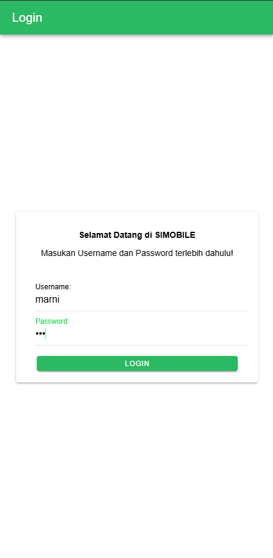

### 2. Halaman Dashboard
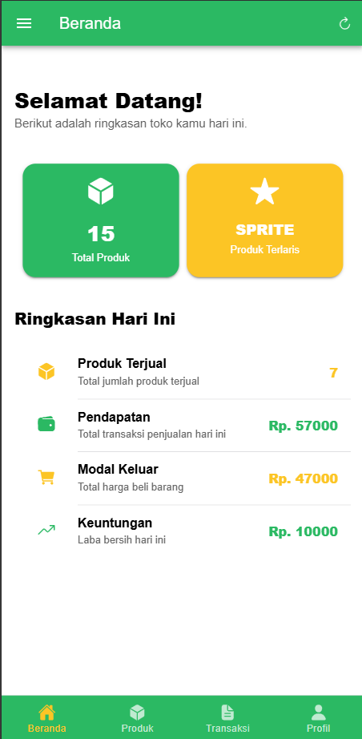

### 3. Halaman Daftar Produk
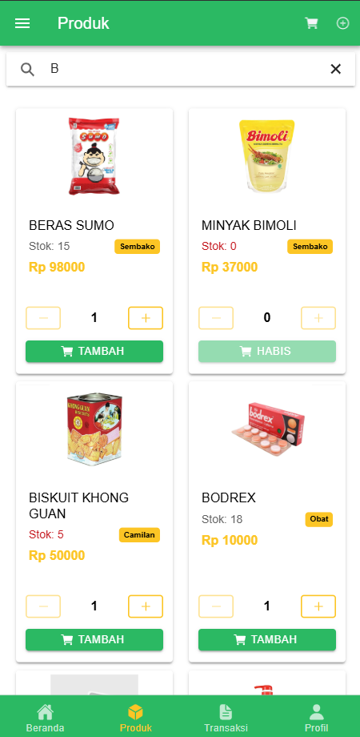

### 4. Halaman Tambah Produk Baru
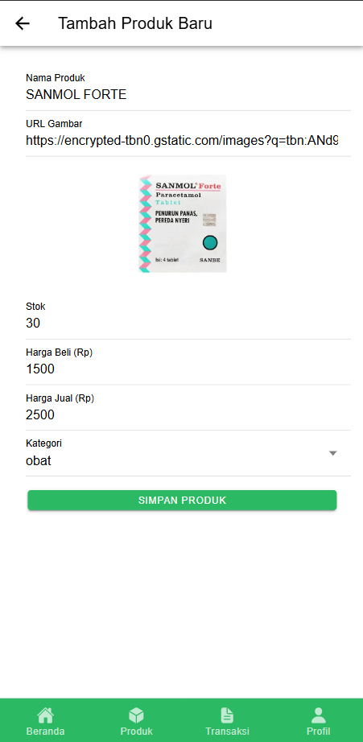

### 5. Halaman Detail Produk
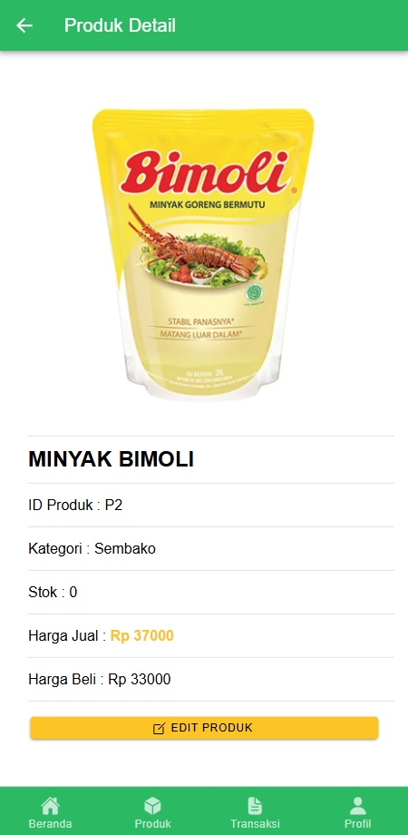

### 6. Halaman Edit Produk
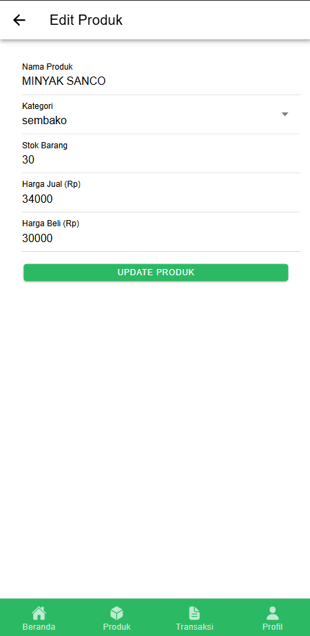

### 7. Halaman Keranjang Belanja
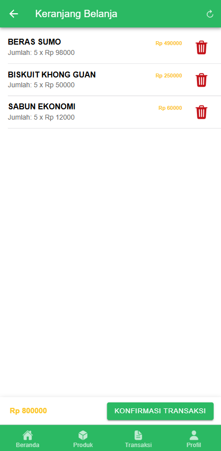

### 8. Halaman Riwayat Transaksi
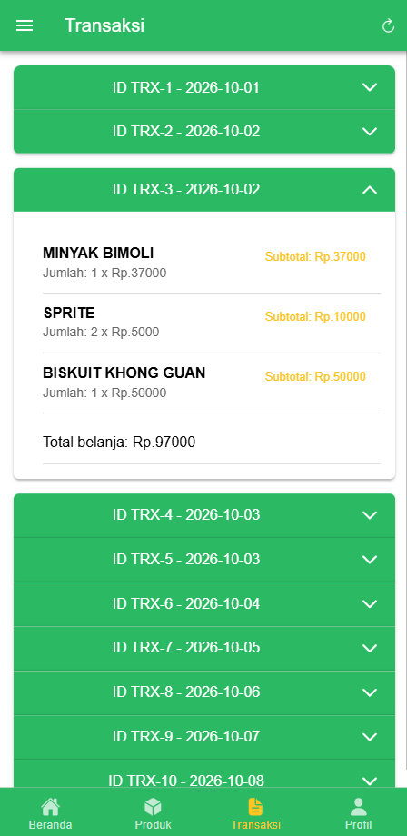

### 9. Halaman Profil Pengguna
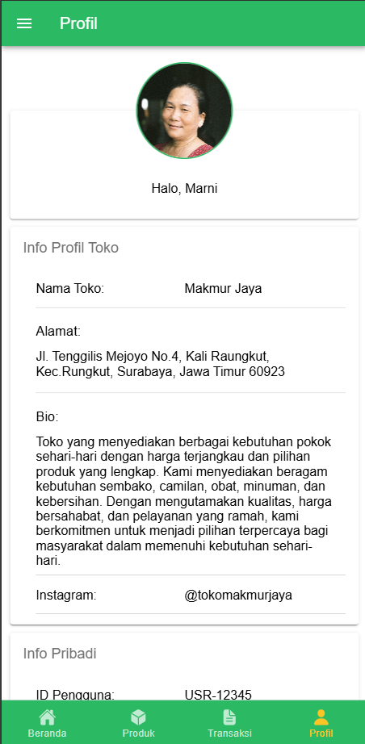

### 10. Halaman Pengaturan
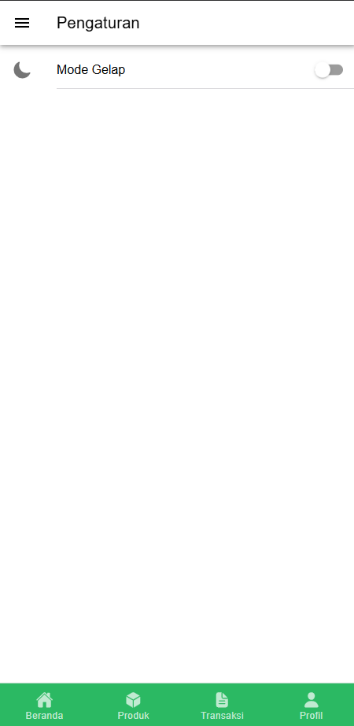

### 11. Halaman Tentang Aplikasi
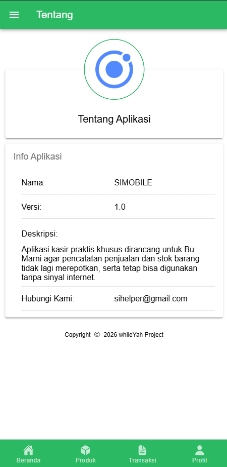

### 12. Fitur Logout
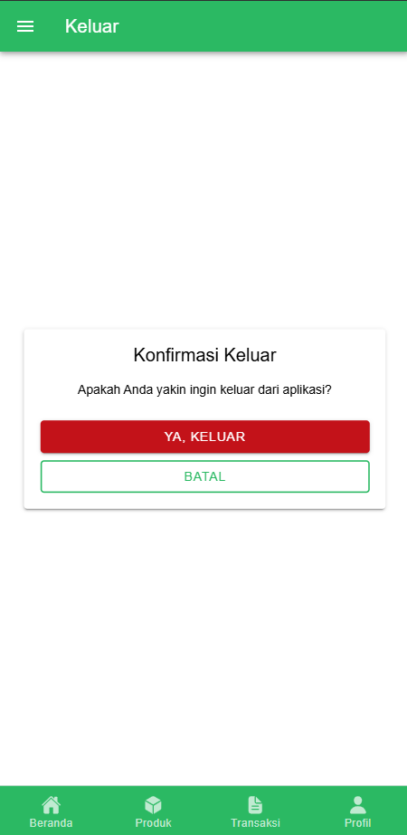

**Dibuat oleh:** whileYah
**Anggota Kelompok:**
- Leonardo Edbert Yongnata (160424024)
- Nicholas Kenneth Mulyajaya (160424032)
- Stefanus Peter Hartono (160424118)
- Hans Stephen Santoso (160424042)